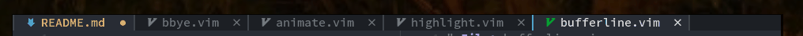

# barbar.nvim

> Tabs, as understood by any other editor.

`barbar.nvim` is a tabline plugin with re-orderable auto-sizing clickable tabs, icons,
nice highlighting, sort-by commands and a magic jump-to-buffer mode. Plus the tab
names are made unique when two filenames match.

In jump-to-buffer mode, tabs display a target letter instead of their icon. Jump to
any buffer by simply typing their target letter. Even better, the target letter
stays constant for the lifetime of the buffer, so if you're working with a set of
files you can even type the letter ahead from memory.

**/!\ NOTE: RECENT NEOVIM NIGHTLY BUILD (0.5) REQUIRED**


##### Table of content
 - [Features](#features)
 - [Install](#install)
 - [Usage](#usage)
 - [Options](#options)
 - [About Barbar](#about)

## Features

##### Re-order tabs


##### Auto-sizing tabs, fill the space when available


##### Jump-to-buffer


Letters stay constant for the lifetime of the buffer. By default, letters are assigned
based on buffer name, eg **README** will get letter **r**. You can change this so that
letters are assigned based on usability: home row (`asdfjkl;gh`) first, then other rows.

##### Sort tabs automatically


`:BufferOrderByDirectory` and `:BufferOrderByLanguage`

##### Clickable & closable tabs


Left-click to go, middle-click or close button to close.

##### Unique names when filenames match


##### bbye.vim for closing buffers

A modified version of [bbye.vim](https://github.com/moll/vim-bbye) is included in this
plugin to close buffers without messing with your window layout and more. Available
as `BufferClose` and `bufferline#bbye#delete(buf)`.

##### Scrollable tabs, to always show the current buffer


## Install

Is ~~two~~ one dependency a lot for one plugin? Yes it is. But is Barbar a very good
tabline plugin? Also yes. Do you now understand why the Install section is
strategically placed after the cool demos? Yes again.

```vim
Plug 'kyazdani42/nvim-web-devicons'
" Plug 'romgrk/lib.kom' -- removed! You can remove it from your vimrc
Plug 'romgrk/barbar.nvim'
```
You can skip the dependency on `'kyazdani42/nvim-web-devicons'` if you
[disable icons](#options).

I might remove the dependencies in the future if I have enough time to port the
required functions, or if you complain loud enough. If you want the icons, don't
forget to install [nerd fonts](https://www.nerdfonts.com/).

##### Requirements
 - Neovim `0.5`

## Usage

### Mappings & commands

No default mappings are provided, here is an example. It is recommended to use
the `BufferClose` command to close buffers instead of `bdelete` because it will
not mess your window layout.

```vim
" Magic buffer-picking mode
nnoremap <silent> <C-s> :BufferPick<CR>
" Sort automatically by...
nnoremap <silent> <Space>bd :BufferOrderByDirectory<CR>
nnoremap <silent> <Space>bl :BufferOrderByLanguage<CR>
" Move to previous/next
nnoremap <silent>    <A-,> :BufferPrevious<CR>
nnoremap <silent>    <A-.> :BufferNext<CR>
" Re-order to previous/next
nnoremap <silent>    <A-<> :BufferMovePrevious<CR>
nnoremap <silent>    <A->> :BufferMoveNext<CR>
" Goto buffer in position...
nnoremap <silent>    <A-1> :BufferGoto 1<CR>
nnoremap <silent>    <A-2> :BufferGoto 2<CR>
nnoremap <silent>    <A-3> :BufferGoto 3<CR>
nnoremap <silent>    <A-4> :BufferGoto 4<CR>
nnoremap <silent>    <A-5> :BufferGoto 5<CR>
nnoremap <silent>    <A-6> :BufferGoto 6<CR>
nnoremap <silent>    <A-7> :BufferGoto 7<CR>
nnoremap <silent>    <A-8> :BufferGoto 8<CR>
nnoremap <silent>    <A-9> :BufferLast<CR>
" Close buffer
nnoremap <silent>    <A-c> :BufferClose<CR>
" Wipeout buffer
"                          :BufferWipeout<CR>
" Other:
" :BarbarEnable - enables barbar (enabled by default)
" :BarbarDisable - very bad command, should never be used
```

## Options

NOTE: Until [#13167](https://github.com/neovim/neovim/pull/13167) is merged,
having too many tabline items shows as "E541" :/ If this happens a lot to you,
you can disable the options `clickable`, `closable`, or `icons` to reduce
the number of items you have.

```vim
" NOTE: This variable doesn't exist before barbar runs. Create it before
"       setting any option.
let bufferline = {}

" Enable/disable animations
let bufferline.animation = v:true

" Enable/disable icons
" if set to "numbers", will show buffer index in the tabline
let bufferline.icons = v:true

" Enable/disable close button
let bufferline.closable = v:true

" Enables/disable clickable tabs
"  - left-click: go to buffer
"  - middle-click: delete buffer
let bufferline.clickable = v:true

" If set, the letters for each buffer in buffer-pick mode will be
" assigned based on their name. Otherwise or in case all letters are
" already assigned, the behavior is to assign letters in order of
" usability (see order below)
let bufferline.semantic_letters = v:true

" New buffer letters are assigned in this order. This order is
" optimal for the qwerty keyboard layout but might need adjustement
" for other layouts.
let bufferline.letters = 
  \ 'asdfjkl;ghnmxcbziowerutyqpASDFJKLGHNMXCBZIOWERUTYQP'

" Sets the maximum padding width with which to surround each tab
let bufferline.maximum_padding = 4

```

### Highlighting

For the highligh groups, here are the default ones. Your colorscheme
can override them by defining them.

```vim
function bufferline#highlight#setup()
   let fg_target = 'red'

   let fg_current  = s:fg(['Normal'], '#efefef')
   let fg_visible  = s:fg(['TabLineSel'], '#efefef')
   let fg_inactive = s:fg(['TabLineFill'], '#888888')

   let fg_modified  = s:fg(['WarningMsg'], '#E5AB0E')
   let fg_special  = s:fg(['Special'], '#599eff')
   let fg_subtle  = s:fg(['NonText', 'Comment'], '#555555')

   let bg_current  = s:bg(['Normal'], '#000000')
   let bg_visible  = s:bg(['TabLineSel', 'Normal'], '#000000')
   let bg_inactive = s:bg(['TabLineFill', 'StatusLine'], '#000000')

   "      Current: current buffer
   "      Visible: visible but not current buffer
   "     Inactive: invisible but not current buffer
   "         -Mod: when modified
   "        -Sign: the separator between buffers
   "      -Target: letter in buffer-picking mode
   call s:hi_all([
   \ ['BufferCurrent',        fg_current,  bg_current],
   \ ['BufferCurrentMod',     fg_modified, bg_current],
   \ ['BufferCurrentSign',    fg_special,  bg_current],
   \ ['BufferCurrentTarget',  fg_target,   bg_current,   'bold'],
   \ ['BufferVisible',        fg_visible,  bg_visible],
   \ ['BufferVisibleMod',     fg_modified, bg_visible],
   \ ['BufferVisibleSign',    fg_visible,  bg_visible],
   \ ['BufferVisibleTarget',  fg_target,   bg_visible,   'bold'],
   \ ['BufferInactive',       fg_inactive, bg_inactive],
   \ ['BufferInactiveMod',    fg_modified, bg_inactive],
   \ ['BufferInactiveSign',   fg_subtle,   bg_inactive],
   \ ['BufferInactiveTarget', fg_target,   bg_inactive,  'bold'],
   \ ])
endfunc
```

You can also use the [doom-one.vim](https://github.com/romgrk/doom-one.vim)
colorscheme that defines those groups and is also very pleasant as you could see
in the demos above.

## About

Barbar is called barbar because it's a bar, but it's also more than a bar:
a "barbar".

It is pronounced like "Jar Jar" in "Jar Jar Binks", but with Bs.

No, barbar has nothing to do with barbarians.

## License

barbar.nvim: Distributed under the terms of the JSON license.  
bbye.vim: Distributed under the terms of the GNU Affero license.  
